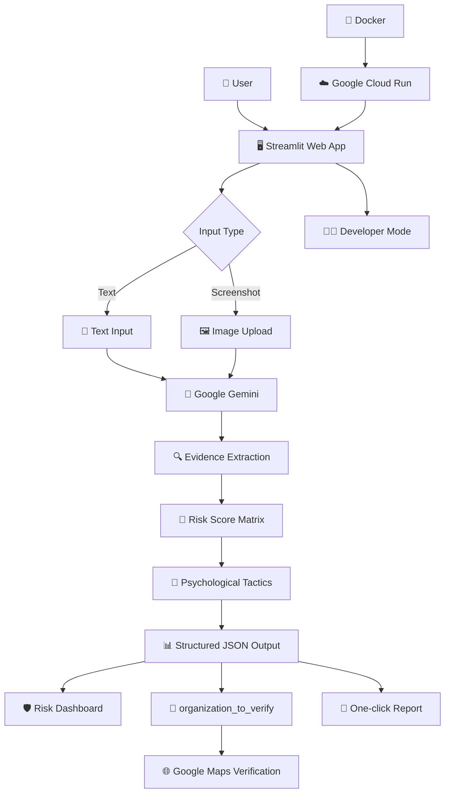

# 🛡️ ScamShield VN

### Trợ lý AI Phân tích & Xác minh Lừa đảo Trực tuyến tại Việt Nam

> **"Không chỉ phát hiện lừa đảo — ScamShield giải thích bằng chứng, hỗ trợ xác minh và hướng dẫn người dùng hành động an toàn."**

[](https://www.python.org/)
[](https://streamlit.io/)
[](https://ai.google.dev/)
[](https://www.docker.com/)
[](https://cloud.google.com/run)

---

## Giới thiệu

**ScamShield VN** là một ứng dụng AI hỗ trợ người dùng Việt Nam **phân tích, giải thích và xử lý các nội dung có dấu hiệu lừa đảo trực tuyến**.

Trong thực tế, nhiều cuộc tấn công lừa đảo không còn đơn giản là những tin nhắn chứa lỗi chính tả hoặc đường link đáng ngờ. Kẻ gian có thể giả danh:

- 👮 Cơ quan công an, tòa án, cơ quan nhà nước
- 🏦 Ngân hàng và ví điện tử
- 📦 Đơn vị vận chuyển
- 🚗 Cơ quan xử lý vi phạm giao thông
- 🪪 Dịch vụ công / VNeID
- 🛒 Sàn thương mại điện tử
- 💼 Nhà tuyển dụng với mô hình "việc nhẹ, lương cao"

Vấn đề không chỉ nằm ở việc **"tin nhắn này có phải scam không?"**, mà còn là:

> **"Dấu hiệu nào khiến nó đáng ngờ?"**  
> **"Mức độ nguy hiểm đến đâu?"**  
> **"Tôi cần làm gì ngay bây giờ?"**

ScamShield VN được xây dựng để trả lời cả ba câu hỏi đó.

Dự án được phát triển trong khuôn khổ **AI Riser Vietnam 2026 — #BuildwithGoogleAI**.

---

# 🎯 Sứ mệnh

> ### Biến một tin nhắn đáng ngờ thành một quyết định an toàn.

ScamShield VN hướng tới quy trình:

```text
       📩 SCAM MESSAGE
              │
              ▼
       🔍 DETECT
      Phát hiện dấu hiệu
              │
              ▼
       🧠 EXPLAIN
      Giải thích bằng chứng
              │
              ▼
       🌐 VERIFY
      Hỗ trợ xác minh
              │
              ▼
        🛡️ ACT
     Hành động an toàn
```
# 🧠 Explainable AI

Một trong những nguyên tắc thiết kế quan trọng nhất của ScamShield:

> ### AI không chỉ đưa ra kết luận — AI phải chỉ ra bằng chứng.

Ví dụ:

```text
🚨 RỦI RO: 87/100

WHY?

🔴 Yêu cầu OTP
   +30

   "Vui lòng cung cấp mã OTP..."

   → OTP có thể được sử dụng để xác thực
     giao dịch hoặc đăng nhập trái phép.

🔴 Mạo danh ngân hàng
   +20

   "Ngân hàng ABC thông báo..."

   → Nội dung tự nhận là đại diện
     cho một tổ chức tài chính.

🟠 Liên kết đáng ngờ
   +15

🟠 Tạo cảm giác khẩn cấp
   +10
```

Mỗi điểm rủi ro cần có **evidence tương ứng**.

---

# 🔐 An toàn & Privacy

ScamShield được thiết kế theo nguyên tắc hạn chế việc yêu cầu thông tin nhạy cảm.

### Không yêu cầu người dùng cung cấp:

- ❌ Mật khẩu ngân hàng.
- ❌ Mã PIN.
- ❌ Mã OTP thật.
- ❌ Thông tin đăng nhập tài khoản.

Nếu nội dung người dùng cung cấp có chứa thông tin nhạy cảm, người dùng nên chủ động che/mask thông tin trước khi upload khi có thể.
---

# 🎯 Design Philosophy

ScamShield VN được xây dựng dựa trên 4 nguyên tắc:

### 01 — Evidence First

> **Không có bằng chứng → Không cộng điểm.**

### 02 — Explainability

> **Người dùng phải hiểu tại sao AI đưa ra cảnh báo.**

### 03 — Actionability

> **Cảnh báo phải đi kèm hành động cụ thể.**

### 04 — Human Verification

> **AI hỗ trợ quyết định; người dùng vẫn là người đưa ra quyết định cuối cùng.**

---

# 🏗️ Kiến trúc hệ thống



---

# 🧰 Tech Stack

| Thành phần | Công nghệ | Vai trò |
|---|---|---|
| Frontend | **Streamlit** | Web Application & UI |
| AI Engine | **Google Gemini** | Phân tích Text + Vision |
| AI Output | **Structured JSON / Output Contract** | Chuẩn hóa kết quả AI |
| Risk Engine | **Risk Score Matrix** | Định lượng mức độ rủi ro |
| Vision | **Gemini Multimodal** | Phân tích screenshot |
| Verification | **Google Maps** | Tra cứu và đối chiếu tổ chức |
| Report | **mailto:** | Tạo báo cáo cảnh báo |
| Container | **Docker** | Đóng gói ứng dụng |
| Deployment | **Google Cloud Run** | Triển khai ứng dụng |

---

